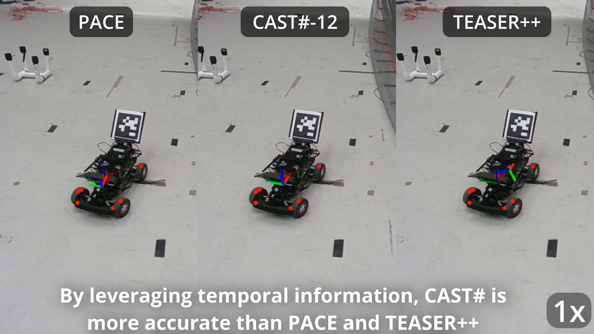

# Certifiable Tracking (MATLAB Implementation)
This is the repository for the paper "A Certifiable Algorithm for Simultaneous Shape Estimation and Object Tracking" by Lorenzo Shaikewitz, Samuel Ubellacker, and Luca Carlone.

Please reference the [Paper](TODO) and [Video](https://youtu.be/eTIlVD9pDtc?si=FfQ1spGXXVddWQFB).

[](http://www.youtube.com/watch?v=eTIlVD9pDtc "CAST# outperforms other certifiable methods in our drone experiment.")

## Setup
To run the solver, this repository has the following dependencies:
- [CertifiablyRobustPerception](https://github.com/MIT-SPARK/CertifiablyRobustPerception/tree/master) (you need to run SPOTLESS install script)
- [MOSEK](https://www.mosek.com/)
- [SDPNAL+](https://blog.nus.edu.sg/mattohkc/softwares/sdpnalplus/)

For outlier rejection, we use the COPT solver:
- [COPT](https://www.copt.de/) (we also provide a cvx version that works with MOSEK, it is just slower)

Reproducing results also requires the following datasets:
- [PASCAL3D+](https://cvgl.stanford.edu/projects/pascal3d.html)
- [YCBInEOAT](https://github.com/wenbowen123/iros20-6d-pose-tracking)

Reproducing ablations requires the following dependency:
- [ROBIN](https://github.com/MIT-SPARK/ROBIN) (for OURS+ROBIN; be sure turn OFF the unit tests in `cmakelists.txt`)

You may set the paths to these dependencies in [setup.m](setup.m). I recommend cloning this repository and these dependencies in the same parent folder.

### Comments on Python
MATLAB's python integration isn't the easiest to debug. If you run into any python errors, first make sure you have all the dependencies installed.

### Running MATLAB
On my machine (Ubuntu 22.04) I needed to set the `LD_PRELOAD` environment variable. To do this, launch MATLAB with the following line:
```
LD_PRELOAD=/lib/x86_64-linux-gnu/libstdc++.so.6 matlab
```
This appears to be necessary to run ROBIN.

### Quick Start
Each time you start MATLAB you must run [setup.m](setup.m) to add the necessary paths. The setup file also allows you to select which experiment/dataset you wish to work with. Options are the subfolders within `experiments`.

Suppose you wish to run the experiments that use synthetic data. First run `setup` with `experiments="synthetic"`. Then, from the home directory run [tracking_outlier_free](experiments/synthetic/tracking_outlier_free.m).

## Reproduce Experiments
All experiment data is linked in [this Google Drive folder](https://drive.google.com/drive/folders/1qeS8ifgsqhh_cenlha8nCwarvQoWelr1?usp=sharing).
### Synthetic Experiments
Please download the [PASCAL3D+ dataset](https://cvgl.stanford.edu/projects/pascal3d.html) (3D models in mat form only). Update the `cadpath` path in [setup.m](setup.m) and run [setup.m](setup.m) with `experiments="pascal"`. The experiments may be run via the following scripts:
- [EKF_Landm](experiments/pascal/EXP_Landm.m) runs the measurement noise experiment.
- [EKF_Landp](experiments/pascal/EXP_Landp.m) runs the process noise experiment.
- [EKF_outlier_ablation](experiments/pascal/EKF_outlier_ablation.m) runs the outlier ratio experiment.
- [EKF_EKF](experiments/pascal/EXP_Landm.m) runs the ground truth EKF comparison.

Note that your results may not exactly match the results from our paper due to the use of random numbers. MAT archives used to generate the data in our paper are available on [Google Drive](https://drive.google.com/drive/folders/1K9kGrST9X2znvUe3DfT6o00OMwAA55e3?usp=sharing).

### YCBInEOAT Experiments
We do not provide the keypoint detector open source. It is trained on [BOP YCBV synthetic data](https://bop.felk.cvut.cz/datasets/). Download the [processed YCBInEOAT data](https://drive.google.com/drive/folders/1HgXWEnaV8zYT8fWRO5GVh4f_ZnicEMDl?usp=sharing) and update the path `jsondir` in [ycbineoat.m](experiments/ycbineoat2/ycbineoat.m) to the folder. Similarly, update the paths under `% get CAD keypoints if there` to the `shapes` directory within the folder you downloaded. Lastly, update the path `models_dir` in [visualize2.m](experiments/ycbineoat2/visualize2.m) to the `models3` directory within the folder you downloaded. Run [setup.m](setup.m) with `experiments="ycbineoat2"`.

YCBInEOAT experiments may now be replicated using [run_ycbineoat.m](experiments/ycbineoat2/run_ycbineoat.m). Simply set the `videoNumber` (index of `videos` array) to select the video. To run with ground truth pixel keypoints, set `params.gt = true`. To view results, use [visualize2.m](experiments/ycbineoat2/visualize2.m). Set the video number as you did in `run_ycbineoat`.

To avoid rerunning CAST# and ablations, move the data from [YCBInEOAT/mat_archives](https://drive.google.com/drive/folders/1ULHA6rhhvGrxEVvgDm3im_P3nXl9HB1i?usp=drive_link) into this repositority's directory and run [visualize2.m](experiments/ycbineoat2/visualize2.m). This is the data used to compute ADD and ADD-S scores in the text.

For for advanced visualization, you will need the [YCBInEOAT data](https://github.com/wenbowen123/iros20-6d-pose-tracking). We do not release the code used to generate videos here.

### Drone Experiment
Please download the racecar data from [Google Drive](https://drive.google.com/drive/folders/1ofVJXtaic49NpBYwZtARl7bDgfd9__NF?usp=sharing). Update the `cadpath` path in [setup.m](setup.m) and run [setup.m](setup.m) with `experiments="racecar_offline"`. For CAST# data use [tracking_frame_lorenzo](experiments/racecar_offline/tracking_frame_lorenzo.m), and for PACE use [tracking_pace](experiments/racecar_offline/tracking_pace.m). Update the paths `problem.json` to the file from Google Drive and `problem.savefile` as desired.

We also provide mat archives of each run in Google Drive. To visualize these, load the data and skip the `solve for each batch` section of the script.

## Notes on Organization
General purpose scripts are in the `visualization`, `utils`, `solvers`, and `outlier_rejection` folders. Within the `experiments` folder are scripts specialized to individual experiments. In general, scripts that begin with "tracking" are single-batch test scripts, while scripts that begin with "EXP" are full experiments.

## Bibtex
COMING SOON